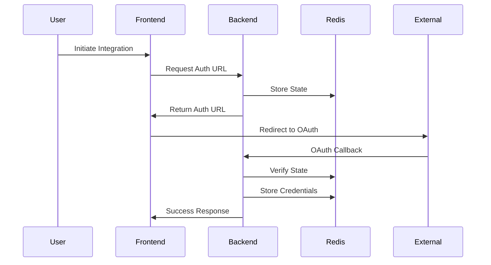

# VectorShift Technical Documentation

## System Architecture

The VectorShift integration platform consists of a FastAPI backend and a Next.js frontend, with Cassandra for persistent storage and Redis for caching.

### Backend Components

#### Authentication System
- **Dual Authentication**: Supports both traditional email/password and Google OAuth2
- **JWT-based**: Uses JWT tokens for session management
- **Password Reset**: Includes secure password reset functionality

#### Database Schema
- **Cassandra Tables**:
  - `users`: User accounts and authentication details
  - `user_profiles`: User profile information
  - `user_integrations`: Integration configurations
  - `user_credentials`: OAuth tokens and credentials
  - `integration_items`: Synchronized data from integrations
  - `password_reset_tokens`: Password reset management

#### Integration System
- **Supported Platforms**:
  - HubSpot: Contact management
  - Notion: Document and database access
  - Slack: Channel communications
  - Airtable: Base and table management

- **OAuth Flow**:


### Frontend Components

#### Authentication Components
- Google Auth Button
- Login/Register Forms
- Password Reset Flow

#### Integration Components
- Integration Cards
- Connection Status Display
- Data Sync Controls
- Error Handling UI

## Setup Instructions

1. **Database Setup**
```bash
# Start Cassandra
docker run -d --name vectorshift-cassandra -p 9042:9042 cassandra:latest

# Start Redis
redis-server

# Initialize Database
cd backend
python init_db.py
```

2. **Environment Variables**
```env
# Backend (.env)
CASSANDRA_HOST=localhost
CASSANDRA_PORT=9042
CASSANDRA_KEYSPACE=vectorshift
JWT_SECRET_KEY=your-secret-key
GOOGLE_CLIENT_ID=your-google-client-id
GOOGLE_CLIENT_SECRET=your-google-secret
HUBSPOT_CLIENT_ID=your-hubspot-client-id
HUBSPOT_CLIENT_SECRET=your-hubspot-secret

# Frontend (.env.local)
NEXT_PUBLIC_BACKEND_URL=http://localhost:8000
```

3. **Backend Setup**
```bash
cd backend
python -m venv venv
source venv/bin/activate  # or `venv\Scripts\activate` on Windows
pip install -r requirements.txt
uvicorn main:app --reload
```

4. **Frontend Setup**
```bash
npm install
npm run dev
```

## API Documentation

### Authentication Endpoints

- `POST /auth/register`: Register new user
- `POST /auth/token`: Login with credentials
- `POST /auth/google/url`: Get Google OAuth URL
- `POST /auth/google/callback`: Handle Google OAuth callback
- `POST /auth/forgot-password`: Initiate password reset
- `POST /auth/reset-password`: Complete password reset

### Integration Endpoints

#### HubSpot
- `POST /integrations/hubspot/authorize`: Start OAuth flow
- `GET /integrations/hubspot/oauth2callback`: OAuth callback
- `POST /integrations/hubspot/credentials`: Get stored credentials
- `POST /integrations/hubspot/get_hubspot_items`: Fetch contacts

Similar endpoints exist for Notion, Slack, and Airtable integrations.

## Security Considerations

1. **Authentication**:
   - Passwords are hashed using bcrypt
   - JWT tokens with expiration
   - OAuth state verification
   - Rate limiting on auth endpoints

2. **Data Protection**:
   - Credentials encrypted in transit
   - OAuth tokens stored securely
   - Session management
   - CORS configuration

3. **Integration Security**:
   - OAuth2 for all integrations
   - Token refresh handling
   - Scope limitations
   - Error handling

## Development Guidelines

1. **Code Structure**:
   - Modular integration implementation
   - Shared utilities and types
   - Consistent error handling
   - Type safety with TypeScript/Pydantic

2. **Testing**:
   - Unit tests for core functionality
   - Integration tests for OAuth flows
   - Error case coverage
   - Mock external services

3. **Best Practices**:
   - Follow FastAPI patterns
   - Use React hooks effectively
   - Implement proper error handling
   - Maintain consistent documentation

## Deployment Considerations

1. **Infrastructure**:
   - Scalable Cassandra cluster
   - Redis for caching
   - Load balancing
   - SSL/TLS configuration

2. **Monitoring**:
   - Integration health checks
   - Authentication metrics
   - Error tracking
   - Performance monitoring

3. **Maintenance**:
   - Database backups
   - Token cleanup
   - Log rotation
   - Version updates
